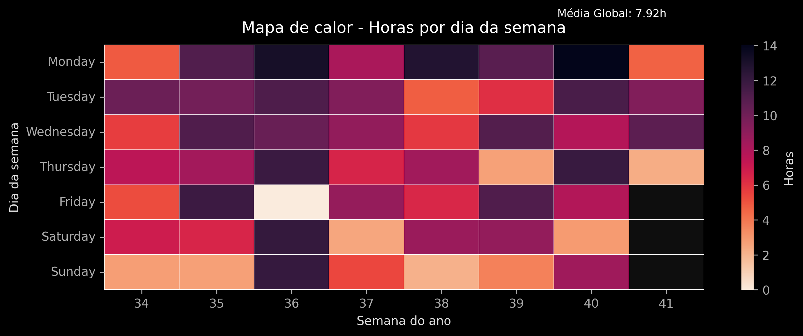

# Productivity Tracker - Maicon Maciel

Monitoramento de produtividade diária através do registro de logins e logouts no computador.  
Gera métricas de tempo ativo, número de sessões e visualizações em gráficos.

## Tecnologias

  
  
  
  

---

## Descrição

Este projeto registra automaticamente os horários de login e logout do usuário no computador, calcula o tempo total ativo por dia e gera visualizações gráficas que ajudam a monitorar a produtividade.  
Os gráficos são atualizados automaticamente pelo script Python sempre que o tracker roda e faz commit no repositório.

---

## Gráficos

### Heatmap de atividade

  

### Atividade últimos 30 dias

@@ -40,28 +39,28 @@

**Estrutura do projeto:**

    productivity_tracker/
    │
    ├─ scripts/
    │ ├─ data_load.py # Faz o commit dos gráficos diariamente
    │ ├─ tracker.py # Coleta logs do Windows
    │ ├─ data_handler.py # Processa dados e gera CSV
    │ └─ graph.py # Gera gráficos de produtividade
    │
    ├─ logs/ # Armazena CSVs e logs diários
    │ └─ raw_log.csv # Dados Brutos
    │ └─ log.csv # # Dados prontos para visualização
    │
    ├─ graphs/ # Armazena gráficos gerados
    │ ├─ activity_heatmap.png
    │ └─ activity_last30.png
    │
    ├─ main.py # Script principal ou integração com Airflow
    ├─ README.md # Este arquivo
    └─ requirements.txt # Requisitos para rodar o projeto

- **Badges:** Docker, Airflow, Python  
- **Badges:** Python, Pandas, Matplotlib
- **Gráficos:** atualizados automaticamente via script  
- **Logs:** CSVs contendo sessões diárias (entrada, saída, tempo total)  
- **Execução:** o script principal pode rodar isoladamente ou via Airflow para automatizar commits diários.